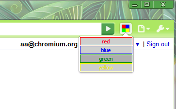
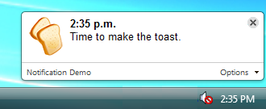
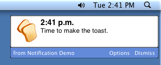
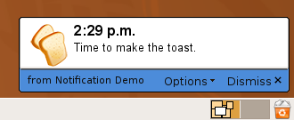
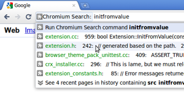
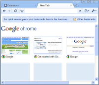
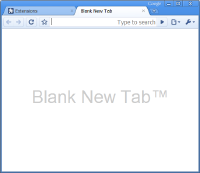

# 改变浏览器外观

# 改变浏览器外观

# Browser Actions

# Browser Actions

## Contents

1.  Manifest
2.  UI 的组成部分
    1.  图标
    2.  tooltip
    3.  Badge
    4.  Popup
3.  Tips
4.  范例
5.  API reference: chrome.browserAction
    1.  Methods
        1.  setBadgeBackgroundColor
        2.  setBadgeText
        3.  setIcon
        4.  setPopup
        5.  setTitle
    2.  Events
        1.  onClicked

用 browser actions 可以在 chrome 主工具条的地址栏右侧增加一个图标。作为这个图标的延展，一个 browser action 图标还可以有 tooltip、badge 和 popup。

如下图, 地址栏右侧的彩色正方形是一个 browser action 的图标， 图标下面的是 popup。



如果你想创建一个不总是可见的图标, 可以使用 page action 来代替 browser action.

**注意:**Packaged apps 不能使用 browser actions.

## Manifest

在 extension manifest 中用下面的方式注册你的 browser action:

```
{
  "name": "My extension",
  ...
  **"browser_action": {
    "default_icon": "images/icon19.png", _// optional_ 
    "default_title": "Google Mail",      _// optional; shown in tooltip_ 
    "default_popup": "popup.html"        _// optional_ 
  }**,
  ...
} 
```

## UI 的组成部分

一个 browser action 可以拥有一个图标，一个 tooltip，一个 badge 和一个 popup。

### 图标

Browser action 图标推荐使用宽高都为 19 像素，更大的图标会被缩小。

你可以用两种方式来设置图标: 使用一个静态图片或者使用 HTML5[canvas element](http://www.whatwg.org/specs/web-apps/current-work/multipage/the-canvas-element.html)。 使用静态图片适用于简单的应用程序，你也可以创建诸如平滑的动画之类更丰富的动态 UI(如 canvas element)。

静态图片可以是任意 WebKit 支持的格式，包括 BMP，GIF，ICO，JPEG 或 PNG。

修改**browser_action**的 manifest 中 **default_icon**字段，或者调用 setIcon()方法。

### ToolTip

修改**browser_action**的 manifest 中**default_title**字段，或者调用 setTitle()方法。你可以为**default_title**字段指定本地化的字符串；点击 Internationalization 查看详情。

### Badge

Browser actions 可以选择性的显示一个*badge*— 在图标上显示一些文本。Badges 可以很简单的为 browser action 更新一些小的扩展状态提示信息。

因为 badge 空间有限，所以只支持 4 个以下的字符。

设置 badge 文字和颜色可以分别使用 setBadgeText()andsetBadgeBackgroundColor()。

### Popup

如果 browser action 拥有一个 popup，popup 会在用户点击图标后出现。popup 可以包含任意你想要的 HTML 内容，并且会自适应大小。

在你的 browser action 中添加一个 popup，创建弹出的内容的 HTML 文件。 修改**browser_action**的 manifest 中**default_popup**字段来指定 HTML 文件， 或者调用 setPopup()方法。

## Tips

为了获得最佳的显示效果, 请遵循以下原则：

*   **确认** Browser actions 只使用在大多数网站都有功能需求的场景下。
*   **确认** Browser actions 没有使用在少数网页才有功能的场景， 此场景请使用 page actions。
*   **确认**你的图标尺寸尽量占满 19x19 的像素空间。 Browser action 的图标应该看起来比 page action 的图标更大更重。
*   **不要**尝试模仿 Google Chrome 的扳手图标，在不同的 themes 下它们的表现可能出现问题,，并且扩展应该醒目些。
*   **尽量**使用 alpha 通道并且柔滑你的图标边缘，因为很多用户使用 themes，你的图标应该在在各种背景下都表现不错。
*   **不要**不停的闪动你的图标，这很惹人反感。

## 范例

你可以在 [examples/api/browserAction](http://src.chromium.org/viewvc/chrome/trunk/src/chrome/common/extensions/docs/examples/api/browserAction/)目录找到简单的 browser actions 范例，更多的范例和帮助文档可以参考 Samples。

## API reference: chrome.browserAction

### Properties

#### getLastError

chrome.extensionlastError

### Methods

#### setBadgeBackgroundColor

void chrome.browserAction.setBadgeBackgroundColor(, object `details`)

Undocumented.

设置 badge 的背景颜色。

#### Parameters

`details`*( optional enumerated Type array of object )*

Undocumented.

Description of this parameter from the json schema.

This parameter was added in version . You must omit this parameter in earlier versions, and you may omit it in any version. If you require this parameter, the manifest key minimum_chrome_version can ensure that your extension won't be run in an earlier browser version.

`color`*( optional enumerated Type array of Type array of integer paramType )*

Undocumented.

范围为[0,255]整数构成的结构，用来描述 badge 的 RGBA 颜色。例如：不透明的红色是[255, 0, 0, 255]。

This parameter was added in version . You must omit this parameter in earlier versions, and you may omit it in any version. If you require this parameter, the manifest key minimum_chrome_version can ensure that your extension won't be run in an earlier browser version.

`tabId`*( optional enumerated Type array of integer )*

Undocumented.

可选参数，将设置限制在被选中的标签，当标签关闭时重置。

This parameter was added in version . You must omit this parameter in earlier versions, and you may omit it in any version. If you require this parameter, the manifest key minimum_chrome_version can ensure that your extension won't be run in an earlier browser version.

#### Returns

#### Callback function

The callback *parameter* should specify a function that looks like this:

If you specify the *callback* parameter, it should specify a function that looks like this:

```
function(Type param1, Type param2) {...}; 
```

This function was added in version . If you require this function, the manifest key minimum_chrome_version can ensure that your extension won't be run in an earlier browser version.

#### setBadgeText

void chrome.browserAction.setBadgeText(, object `details`)

Undocumented.

设置 browser action 的 badge 文字，badge 显示在图标上面。

#### Parameters

`details`*( optional enumerated Type array of object )*

Undocumented.

Description of this parameter from the json schema.

This parameter was added in version . You must omit this parameter in earlier versions, and you may omit it in any version. If you require this parameter, the manifest key minimum_chrome_version can ensure that your extension won't be run in an earlier browser version.

`text`*( optional enumerated Type array of string )*

Undocumented.

任意长度的字符串，但只有前 4 个字符会被显示出来。

This parameter was added in version . You must omit this parameter in earlier versions, and you may omit it in any version. If you require this parameter, the manifest key minimum_chrome_version can ensure that your extension won't be run in an earlier browser version.

`tabId`*( optional enumerated Type array of integer )*

Undocumented.

可选参数，将设置限制在被选中的标签，当标签关闭时重置。

This parameter was added in version . You must omit this parameter in earlier versions, and you may omit it in any version. If you require this parameter, the manifest key minimum_chrome_version can ensure that your extension won't be run in an earlier browser version.

#### Returns

#### Callback function

The callback *parameter* should specify a function that looks like this:

If you specify the *callback* parameter, it should specify a function that looks like this:

```
function(Type param1, Type param2) {...}; 
```

This function was added in version . If you require this function, the manifest key minimum_chrome_version can ensure that your extension won't be run in an earlier browser version.

#### setIcon

void chrome.browserAction.setIcon(, object `details`)

Undocumented.

设置 browser action 的图标。图标可以是一个图片的路径或者是从一个 canvas 元素提取的像素信息.。无论是**图标路径**还是 canvas 的 **imageData**，这个属性必须被指定。

#### Parameters

`details`*( optional enumerated Type array of object )*

Undocumented.

Description of this parameter from the json schema.

This parameter was added in version . You must omit this parameter in earlier versions, and you may omit it in any version. If you require this parameter, the manifest key minimum_chrome_version can ensure that your extension won't be run in an earlier browser version.

`imageData`*( optional enumerated Type array of ImageData )*

Undocumented.

图片的像素信息。必须是一个 ImageData 对象(例如：一个 canvas 元素)。

This parameter was added in version . You must omit this parameter in earlier versions, and you may omit it in any version. If you require this parameter, the manifest key minimum_chrome_version can ensure that your extension won't be run in an earlier browser version.

`path`*( optional enumerated Type array of string )*

Undocumented.

图片在扩展中的的相对路径。

This parameter was added in version . You must omit this parameter in earlier versions, and you may omit it in any version. If you require this parameter, the manifest key minimum_chrome_version can ensure that your extension won't be run in an earlier browser version.

`tabId`*( optional enumerated Type array of integer )*

Undocumented.

可选参数，将设置限制在被选中的标签，当标签关闭时重置。

This parameter was added in version . You must omit this parameter in earlier versions, and you may omit it in any version. If you require this parameter, the manifest key minimum_chrome_version can ensure that your extension won't be run in an earlier browser version.

#### Returns

#### Callback function

The callback *parameter* should specify a function that looks like this:

If you specify the *callback* parameter, it should specify a function that looks like this:

```
function(Type param1, Type param2) {...}; 
```

This function was added in version . If you require this function, the manifest key minimum_chrome_version can ensure that your extension won't be run in an earlier browser version.

#### setPopup

void chrome.browserAction.setPopup(, object `details`)

Undocumented.

设置一个点击 browser actions 时显示在 popup 中的 HTML。

#### Parameters

`details`*( optional enumerated Type array of object )*

Undocumented.

Description of this parameter from the json schema.

This parameter was added in version . You must omit this parameter in earlier versions, and you may omit it in any version. If you require this parameter, the manifest key minimum_chrome_version can ensure that your extension won't be run in an earlier browser version.

`tabId`*( optional enumerated Type array of integer )*

Undocumented.

可选参数，将设置限制在被选中的标签，当标签关闭时重置。

This parameter was added in version . You must omit this parameter in earlier versions, and you may omit it in any version. If you require this parameter, the manifest key minimum_chrome_version can ensure that your extension won't be run in an earlier browser version.

`popup`*( optional enumerated Type array of string )*

Undocumented.

popup 中显示的 html 文件。如果设置为空字符('')，将不显示 popup。

This parameter was added in version . You must omit this parameter in earlier versions, and you may omit it in any version. If you require this parameter, the manifest key minimum_chrome_version can ensure that your extension won't be run in an earlier browser version.

#### Returns

#### Callback function

The callback *parameter* should specify a function that looks like this:

If you specify the *callback* parameter, it should specify a function that looks like this:

```
function(Type param1, Type param2) {...}; 
```

这个功能已经在**chromium 5.0.316.0 版本**添加。如果你需要这个功能，可以通过 manifest 的 minimum_chrome_version 键值来确认你的扩展不会运行在早期的浏览器版本。

#### setTitle

void chrome.browserAction.setTitle(, object `details`)

Undocumented.

设置 browser action 的标题，这个将显示在 tooltip 中。

#### Parameters

`details`*( optional enumerated Type array of object )*

Undocumented.

Description of this parameter from the json schema.

This parameter was added in version . You must omit this parameter in earlier versions, and you may omit it in any version. If you require this parameter, the manifest key minimum_chrome_version can ensure that your extension won't be run in an earlier browser version.

`title`*( optional enumerated Type array of string )*

Undocumented.

鼠标移动到 browser action 上时显示的文字。

This parameter was added in version . You must omit this parameter in earlier versions, and you may omit it in any version. If you require this parameter, the manifest key minimum_chrome_version can ensure that your extension won't be run in an earlier browser version.

`tabId`*( optional enumerated Type array of integer )*

Undocumented.

可选参数，将设置限制在被选中的标签，当标签关闭时重置。

This parameter was added in version . You must omit this parameter in earlier versions, and you may omit it in any version. If you require this parameter, the manifest key minimum_chrome_version can ensure that your extension won't be run in an earlier browser version.

#### Returns

#### Callback function

The callback *parameter* should specify a function that looks like this:

If you specify the *callback* parameter, it should specify a function that looks like this:

```
function(Type param1, Type param2) {...}; 
```

This function was added in version . If you require this function, the manifest key minimum_chrome_version can ensure that your extension won't be run in an earlier browser version.

### Events

#### onClicked

chrome.browserAction.onClicked.addListener(function(Tab tab) {...});

Undocumented.

当 browser action 图标被点击的时候触发，当 browser action 是一个 popup 的时候，这个事件将不会被触发。

#### Parameters

`tab`*( optional enumerated Tab array of paramType )*

Undocumented.

Description of this parameter from the json schema.

This parameter was added in version . You must omit this parameter in earlier versions, and you may omit it in any version. If you require this parameter, the manifest key minimum_chrome_version can ensure that your extension won't be run in an earlier browser version.

### Types

#### type name

# Context Menus

# Context Menus

## 内容

1.  清单
2.  范例
3.  API 参考: Chrome.contextMenus
    1.  方法
        1.  create
        2.  remove
        3.  removeAll
        4.  update
    2.  类型
        1.  OnClickData

Context 菜单用于在 Chrome 的右键菜单中增加自己的菜单项。

您可以选择针对不同类型的对象（如图片，链接，页面）增加右键菜单项。

您可以根据需要添加多个右键菜单项。一个扩展里添加的多个右键菜单项会被 Chrome 自动组合放到对应扩展名称的二级菜单里。

右键菜单可以出现在任意文档（或文档中的框架）中，甚至是本地文件（如 file://或者 Chrome://）中。若想控制右键菜单在不同文档中的显示，可以在调用 create()和 update()时指定 documentUrlPatterns。

**版本说明：** 低于 Chrome 14 的版本,右键菜单只能用于 http:// 或者 https:// 类型的文档。

## 清单

要使用 contentMenus API，您必须在清单中声明“contentMenus”权限。同时，您应该指定一个 16x16 的图标用作右键菜单的标识。例如：

```
{
        "name": "My extension",
        ...
        "permissions": [
          **"contextMenus"**
        ],
        "icons": {
          **"16": "icon-bitty.png",**
          "48": "icon-small.png",
          "128": "icon-large.png"
        },
        ...
} 
```

</a>

## 范例

您可以在代码例子页面找到使用 contentMenus API 的简单范例。

## API 参考: Chrome.contextMenus

### 方法

#### create

integer Chrome.contextMenus.create(object `createProperties`, function `callback`)

创建一个新的右键菜单项。注意：如果在创建的过程中出现错误，会在回调函数触发后才能捕获到，错误详细信息保存在 Chrome.extension.lastError 中。

#### 参数

`createProperties`*( object )*

Undocumented.

`type`*( optional enumerated string ["normal", "checkbox", "radio", "separator"] )*

右键菜单项的类型。默认为“normal”。

`title`*( optional string )*

右键菜单项的显示文字；除非为“separator”*类型*，否则此参数是*必须*的。如果类型为“selection”，您可以在字符串中使用`%s`显示选定的文本。例如，如果参数的值为 "Translate '%s' to Pig Latin"，而用户还选中了文本“cool”，那么显示在菜单中的将会是 "Translate 'cool' to Pig Latin"。

`checked`*( optional boolean )*

Checkbox 或者 radio 的初始状态：true 代表选中，false 代表未选中。在给定的 radio 中只能有一个处于选中状态。

`contexts`*( optional array of string ["all", "page", "frame", "selection", "link", "editable", "image", "video", "audio"] )*

右键菜单项将会在这个列表指定的上下文类型中显示。默认为“page”。

`onclick`*( optional function )*

当菜单项被点击时触发的函数。

##### 参数

`info`*( OnClickData )*

右键菜单项被点击时相关的上下文信息。

`tab`*( Tab )*

右键菜单项被点击时，当前标签的详细信息。

`parentId`*( optional integer )*

右键菜单项的父菜单项 ID。指定父菜单项将会使此菜单项成为父菜单项的子菜单。

`documentUrlPatterns`*( optional array of string )*

这使得右键菜单只在匹配此模式的 url 页面上生效（这个对框架也适用）。详细的匹配格式见：模式匹配页面。

`targetUrlPatterns`*( optional array of string )*

类似于 documentUrlPatterns，但是您可以针对 img/audio/video 标签的 src 属性和 anchor 标签的 href 做过滤。

`enabled`*( optional boolean )*

启用或者禁用此菜单项，启用为 true，禁用为 false。默认为 true。

`callback`*( optional function )*

在创建完菜单项后触发。如果创建过程中有错误产生，其详细信息在 Chrome.extension.lastError 中。

#### 返回

*( integer )*

新创建右键菜单项的 ID。

#### 回调

如果需要指定*回调函数*，则回调函数格式如下：

```
function() {...}; 
```

#### remove

Chrome.contextMenus.remove(integer `menuItemId`, function `callback`)

删除一个右键菜单。

#### 参数

`menuItemId`*( integer )*

待删除的右键菜单项的 ID

`callback`*( optional function )*

当右键菜单项被删除后触发。

#### 回调

如果需要指定*回调函数*，则回调函数格式如下：

```
function() {...}; 
```

#### removeAll

Chrome.contextMenus.removeAll(function `callback`)

删除此扩展添加的所有右键菜单项。

#### 参数

`callback`*( optional function )*

删除完成后触发。

#### 回调

如果需要指定*回调函数*，则回调函数格式如下：

```
function() {...}; 
```

#### update

Chrome.contextMenus.update(integer `id`, object `updateProperties`, function `callback`)

更新已创建的右键菜单项。

#### 参数

`id`*( integer )*

待更新的右键菜单项的 ID.

`updateProperties`*( object )*

待更新的属性。与创建右键菜单项时的属性参数一样。

`type`*( optional enumerated string ["normal", "checkbox", "radio", "separator"] )*

Undocumented.

`title`*( optional string )*

Undocumented.

`checked`*( optional boolean )*

Undocumented.

`contexts`*( optional array of string ["all", "page", "frame", "selection", "link", "editable", "image", "video", "audio"] )*

Undocumented.

`onclick`*( optional function )*

Undocumented.

`parentId`*( optional integer )*

注意：不能将右键菜单项设置成自己子菜单的子菜单。

`documentUrlPatterns`*( optional array of string )*

Undocumented.

`targetUrlPatterns`*( optional array of string )*

Undocumented.

`enabled`*( optional boolean )*

Undocumented.

`callback`*( optional function )*

右键菜单项更新完成后触发。

#### 回调

如果需要指定*回调函数*，则回调函数格式如下：

```
function() {...}; 
```

### 类型

#### OnClickData

*( object )*

当右键菜单项被点击时的信息。

`menuItemId`*( integer )*

被点击的右键菜单项的 ID。

`parentMenuItemId`*( optional integer )*

被点击的右键菜单项的父菜单（如果存在）ID。

`mediaType`*( optional string )*

点击激活此右键菜单项时，被点击的元素的类型，如:'image', 'video'或者 'audio'。

`linkUrl`*( optional string )*

链接的 url（如果被点击的元素是链接）。

`srcUrl`*( optional string )*

如果被点击元素有 'src' 属性。

`pageUrl`*( string )*

点击所在页面的 URL。

`frameUrl`*( optional string )*

框架元素的 URL（如果点击的元素是一个框架）。

`selectionText`*( optional string )*

如果点击时选择了文本，则为选中的文本内容。

`editable`*( string )*

被点击的元素是否可编辑，比如文本输入框就是可编辑的。

# 桌面通知

# 桌面通知

通知用户发生了一些重要的事情。桌面通知会显示在浏览器窗口之外。 下面的图片是通知显示时的效果，在不同的平台下，通知的显示效果会有些细微区别。

  

通常直接使用一小段 JavaScript 代码创建通知，当然也可以通过扩展包内的一个单独 HTML 页面。

## 声明

可以在 extension manifest 中声明使用通知权限，像这样：

```
{
  "name": "My extension",
  ...
 **"permissions": [
    "notifications"
  ]**,
  ...
} 
```

**注意：** 扩展声明的 `notifications` 权限总是允许创建通知。 这样申明之后就不再需要调用 `webkitNotifications.checkPermission()`。

## 与扩展页面交互

扩展可以使用 getBackgroundPage() 和 getViews()在通知与扩展页面中建立交互。 例如：

```
// 在通知中调用扩展页面方法...
chrome.extension.getBackgroundPage().doThing();

// 从扩展页面调用通知的方法...
chrome.extension.getViews({type:"notification"}).forEach(function(win) {
  win.doOtherThing();
}); 
```

## 例子

一个简单的使用通知的例子，参见 [examples/api/notifications](http://src.chromium.org/viewvc/chrome/trunk/src/chrome/common/extensions/docs/examples/api/notifications/) 目录。 更多的例子，以及在查看代码中遇到的一些问题，请参见 代码例子。

也可以参考 html5rocks.com 的 [通知指南](http://www.html5rocks.com/tutorials/notifications/quick/)。 如果你只是声明 "通知" 的权限，可以忽略权限相关的代码，它不是必要的。

## API

扩展的桌面通知 API ，也可用于显示一个网页。 如以下代码所示，首先创建一个简单的文字通知或 HTML 通知，然后显示通知。

```
// 创建一个简单的文字通知：
var notification = webkitNotifications.createNotification(
  '48.png',  // icon url - can be relative
  'Hello!',  // notification title
  'Lorem ipsum...'  // notification body text
);

// 或者创建一个 HTML 通知：
var notification = webkitNotifications.createHTMLNotification(
  'notification.html'  // html url - can be relative
);

// 显示通知
notification.show(); 
```

完整的 API 详情，请参看 [Desktop notifications draft specification](http://dev.chromium.org/developers/design-documents/desktop-notifications/api-specification)。

## API reference: chrome.apiname

### Properties

#### getLastError

chrome.extensionlastError

### Methods

#### method name

void chrome.module.methodName(, ``)

Undocumented.

A description from the json schema def of the function goes here.

#### Parameters

#### Returns

#### Callback function

The callback *parameter* should specify a function that looks like this:

If you specify the *callback* parameter, it should specify a function that looks like this:

```
function(Type param1, Type param2) {...}; 
```

This function was added in version . If you require this function, the manifest key minimum_chrome_version can ensure that your extension won't be run in an earlier browser version.

### Events

#### event name

chrome.bookmarksonEvent.addListener(function(Type param1, Type param2) {...});

Undocumented.

A description from the json schema def of the event goes here.

#### Parameters

### Types

#### type name

# Omnibox

# Omnibox

## Contents

1.  Manifest
2.  示例
3.  API reference: chrome.omnibox
    1.  Methods
        1.  setDefaultSuggestion
    2.  Events
        1.  onInputCancelled
        2.  onInputChanged
        3.  onInputEntered
        4.  onInputStarted
    3.  Types
        1.  SuggestResult

omnibox 应用程序界面允许向 Google Chrome 的地址栏注册一个关键字，地址栏也叫 omnibox。



当用户输入你的扩展关键字，用户开始与你的扩展交互。每个击键都会发送给你的扩展，扩展提供建议作为相应的响应。

建议可以被格式化多种方式。当用户接受建议，你的扩展被通知可以执行动作。

## Manifest

使用 omnibox 应用程序界面，必须在 manifest 中包含 omnibox 关键字段。需要指定像素为 16x16 的图标，以便当用户输入关键字时，在地址栏中显示。

如：

```
{
  "name": "Aaron's omnibox extension",
  "version": "1.0",
  **"omnibox": { "keyword" : "aaron" },** 
  **"icons": {** 
    **"16": "16-full-color.png"** 
  **},** 
  "background_page": "background.html"
} 
```

**提示:** Chrome 自动创建灰度模式 16x16 像素的图标。你应该提供全色版本图标以便可以在其他场景下使用。 如：Context menus API

使用全色的 16x16 像素图标。

## 示例

从 sample page 页面可以找到使用该 API 的例子。.

## 应用程序界面参考: chrome.omnibox

### Methods

#### method name

void chrome.module.methodName(, ``)

Undocumented.

A description from the json schema def of the function goes here.

#### Parameters

#### Returns

#### Callback function

The callback *parameter* should specify a function that looks like this:

If you specify the *callback* parameter, it should specify a function that looks like this:

```
function(Type param1, Type param2) {...}; 
```

This function was added in version . If you require this function, the manifest key minimum_chrome_version can ensure that your extension won't be run in an earlier browser version.

#### setDefaultSuggestion

void chrome.omnibox.setDefaultSuggestion(, object `suggestion`)

Undocumented.

设置缺省建议的描述和风格。缺省建议是显示在 URL 地址栏下的第一个建议显示文字

#### Parameters

`suggestion`*( optional enumerated Type array of object )*

Undocumented.

一个局部的 SuggestResult 对象，没有'content' 参数。关于该参数的描述，请参见 SuggestResult。

This parameter was added in version . You must omit this parameter in earlier versions, and you may omit it in any version. If you require this parameter, the manifest key minimum_chrome_version can ensure that your extension won't be run in an earlier browser version.

`description`*( optional enumerated Type array of string )*

Undocumented.

显示在缺省建议中的文本，可以包含'%s'并可以被用户输入替换。

This parameter was added in version . You must omit this parameter in earlier versions, and you may omit it in any version. If you require this parameter, the manifest key minimum_chrome_version can ensure that your extension won't be run in an earlier browser version.

#### Returns

#### Callback function

The callback *parameter* should specify a function that looks like this:

If you specify the *callback* parameter, it should specify a function that looks like this:

```
function(Type param1, Type param2) {...}; 
```

This function was added in version . If you require this function, the manifest key minimum_chrome_version can ensure that your extension won't be run in an earlier browser version.

### Events

#### onInputCancelled

chrome.omnibox.onInputCancelled.addListener(function() {...});

Undocumented.

用户结束键盘输入会话，但未接受该输入（取消了输入）。

#### Parameters

#### onInputChanged

chrome.omnibox.onInputChanged.addListener(function(string text, function suggest) {...});

Undocumented.

用户修改了在 omnibox 中的输入。

#### Parameters

`text`*( optional enumerated Type array of string )*

Undocumented.

Description of this parameter from the json schema.

This parameter was added in version . You must omit this parameter in earlier versions, and you may omit it in any version. If you require this parameter, the manifest key minimum_chrome_version can ensure that your extension won't be run in an earlier browser version.

`suggest`*( optional enumerated Type array of function )*

Undocumented.

一个传给 onInputChanged 事件的回调，用来在事件发生的时候，发送回建议给浏览器。

This parameter was added in version . You must omit this parameter in earlier versions, and you may omit it in any version. If you require this parameter, the manifest key minimum_chrome_version can ensure that your extension won't be run in an earlier browser version.

##### Parameters

`paramName`*( optional enumerated Type array of SuggestResult array of paramType paramType )*

Undocumented.

建议结果，数组。

This parameter was added in version . You must omit this parameter in earlier versions, and you may omit it in any version. If you require this parameter, the manifest key minimum_chrome_version can ensure that your extension won't be run in an earlier browser version.

#### onInputEntered

chrome.omnibox.onInputEntered.addListener(function(string text) {...});

Undocumented.

用户接收了 omnibox 中的数据。

#### Parameters

`text`*( optional enumerated Type array of string )*

Undocumented.

Description of this parameter from the json schema.

This parameter was added in version . You must omit this parameter in earlier versions, and you may omit it in any version. If you require this parameter, the manifest key minimum_chrome_version can ensure that your extension won't be run in an earlier browser version.

#### onInputStarted

chrome.omnibox.onInputStarted.addListener(function() {...});

Undocumented.

用户输入扩展的关键字，开始了一个键盘输入会话。 这个事件在会话开始时发送，早于其它事件，而且一个会话只会发送一次。

#### Parameters

### Types

#### SuggestResult

`paramName`*( optional enumerated Type array of object )*

Undocumented.

建议结果。

This parameter was added in version . You must omit this parameter in earlier versions, and you may omit it in any version. If you require this parameter, the manifest key minimum_chrome_version can ensure that your extension won't be run in an earlier browser version.

`content`*( optional enumerated Type array of string )*

Undocumented.

在 URL 区域中的文本，当用户选择该条目时发送给扩展。

This parameter was added in version . You must omit this parameter in earlier versions, and you may omit it in any version. If you require this parameter, the manifest key minimum_chrome_version can ensure that your extension won't be run in an earlier browser version.

`description`*( optional enumerated Type array of string )*

Undocumented.

The URL 下拉列表中显示的文本。可以包含一个 XML 风格标记。支持的标签是'url' (作为一个文法上的 URL)， 'match' (作为匹配用户请求数据的高亮文本显示)，以及 'dim' (作为灰色辅助文本)。风格可以嵌套。

## 选项页

为了让用户设定你的扩展功能，你可能需要提供一个选项页。如果你提供了选项页，在扩展管理页面 chrome://extensions 上会提供一个链接。点击选项链接就可以打开你的选项页。

## 在 manifest 中定义你的选项页

```
{
  "name": "My extension",
  ...
  **"options_page": "options.html"**,
  ...
} 
```

## 编写你的选项页

下面是个选项页的范例:

```
<html>
<head><title>My Test Extension Options</title></head>
<script type="text/javascript">
// Saves options to localStorage.
function save_options() {
  var select = document.getElementById("color");
  var color = select.children[select.selectedIndex].value;
  localStorage["favorite_color"] = color;
  // Update status to let user know options were saved.
  var status = document.getElementById("status");
  status.innerHTML = "Options Saved.";
  setTimeout(function() {
    status.innerHTML = "";
  }, 750);
}
// Restores select box state to saved value from localStorage.
function restore_options() {
  var favorite = localStorage["favorite_color"];
  if (!favorite) {
    return;
  }
  var select = document.getElementById("color");
  for (var i = 0; i < select.children.length; i++) {
    var child = select.children[i];
    if (child.value == favorite) {
      child.selected = "true";
      break;
    }
  }
}
</script>
<body onload="restore_options()">
Favorite Color:
<select id="color">
 <option value="red">red</option>
 <option value="green">green</option>
 <option value="blue">blue</option>
 <option value="yellow">yellow</option>
</select>
<br>
<button onclick="save_options()">Save</button>
</body>
</html> 
```

## 注意事项

*   本功能在 Chromium4.0.222.x 以上版本生效。
*   为了鼓励不同扩展之间的选项页的一致性，我们计划提供一些默认的 css 样式。你可以关注 [crbug.com/25317](http://crbug.com/25317)的更新。

# Override 替代页

# Override 替代页

使用替代页，可以将 Chrome 默认的一些特定页面替换掉，改为使用扩展提供的页面。这让扩展开发者可以开发更多有趣或者实用的基本功能页面。替代页通常会有大量的 CSS 和 JavaScript 代码。

扩展可以替代如下页面：

*   **书签管理器：**从工具菜单上点击书签管理器时访问的页面，或者从地址栏直接输入 **chrome://bookmarks**。
*   **历史记录：**从工具菜单上点击历史记录时访问的页面，或者从地址栏直接输入 **chrome://history**。
*   **新标签页：**当创建新标签的时候访问的页面，或者从地址栏直接输入 **chrome://newtab**。

**注意：**一个扩展只能替代一个页面。

**注意：**如果你替代隐身窗口的页面，请注意要在 manifest 中将 incognito 属性指定为 "spanning"。

**注意：**你不能替代隐身窗口的新标签页。

下面的截图是默认的新标签页和被扩展替换掉的新标签页。

| **默认的新标签页** | **替代的新标签页** |
| --- | --- |
|  |  |

## Manifest

下面是在 extension manifest 中注册替代页的写法。

```
{
  "name": "My extension",
  ...

 **"chrome_url_overrides" : {
    "_pageToOverride_": "_myPage.html_"
  }**,
  ...
} 
```

对于示例中的*pageToOverride*，可替换成如下关键字

*   bookmarks
*   history
*   newtab

## 提示

要制作一个优秀的替代页，请一定遵循如下指导原则：

*   **你的页面实现的要即小又快。** 用户希望内建的浏览器页面可以快速的打开，请避免做一些要消耗很多时间的事。如：尽量避免从网络中或者数据库资源中提取数据。

*   **页面要带标题。** 否则用户可能会看到网页的 URL，造成困扰。其实就是在页面头上加入：<title>NewTab</title>

*   **别指望页面会获得键盘输入焦点。** 通常新标签创建的时候，地址栏会获得输入焦点，而不是页面。

*   **别试着模仿默认的新标签页。** 对于新标签页上的重要功能支持，如：最近关闭的标签、主题背景图等，APIs 的支持尚未完善，在这些 APIs 确认完备之前，你最好做一些完全不同的新标签页设计（以避免使用这些非正式的 APIs）。

## 范例

你可以在这里找到范例[examples/api/override](http://src.chromium.org/viewvc/chrome/trunk/src/chrome/common/extensions/docs/examples/api/override/)，其他范例在这里 Samples

# Page Actions

# Page Actions

## Contents

1.  Manifest
2.  UI 的组成部分
3.  提示
4.  示例
5.  API reference: chrome.pageAction
    1.  Methods
        1.  hide
        2.  setIcon
        3.  setPopup
        4.  setTitle
        5.  show
    2.  Events
        1.  onClicked

使用 page actions 把图标放置到地址栏里。page actions 定义需要处理的页面的事件，但是它们不是适用于所有页面的。下面是一些 page actions 的示例：

*   订阅该页面的 RSS feed
*   为页面的图片做一个幻灯片

在下面的屏幕截图中的 RSS 图标，提供了一个可以让用户订阅当前页面 RSS Feed 的 page action。


想让扩展图标总是可见，则使用 browser action。

**注意：** 打包的应用程序不能使用 page actions。

## Manifest

在 extension manifest 中用下面的方式注册你的 page action：

```
{
  "name": "My extension",
  ...
  **"page_action": {
    "default_icon": "icons/foo.png", _// optional_
    "default_title": "Do action",    _// optional; shown in tooltip_
    "default_popup": "popup.html"    _// optional_
  }**,
  ...
} 
```

## UI 的组成部分

同 browser actions 一样，page actions 可以有图标、提示信息、 弹出窗口。但没有 badge，也因此，作为辅助，page actions 可以有显示和消失两种状态。阅读 browser action UI. 可以找到图标、提示信息、 弹出窗口相关信息。

使用方法 show() 和 hide() 可以显示和隐藏 page action。缺省情况下 page action 是隐藏的。当要显示时，需要指定图标所在的标签页，图标显示后会一直可见，直到该标签页关闭或开始显示不同的 URL （如：用户点击了一个连接）

## 提示

为了获得最佳的视觉效果，请遵循下列指导方针：

*   **要**只对少数页面使用 page action；
*   **不要**对大多数页面使用它，如果功能需要，使用 browser actions 代替。
*   **没事别总让图标出现动画，那会让人很烦。**

## 示例

你可以在[examples/api/pageAction](http://src.chromium.org/viewvc/chrome/trunk/src/chrome/common/extensions/docs/examples/api/pageAction/) 找到使用 page action 的简单示例，其它例子和源代码帮助查看 Samples。

## API reference: chrome.pageAction

### Properties

#### getLastError

chrome.extensionlastError

### Methods

#### hide

void chrome.pageAction.hide(, integer `tabId`)

Undocumented.

隐藏 page action.

#### Parameters

`tabId`*( optional enumerated Type array of integer )*

Undocumented.

要执行这个动作的标签 ID。

This parameter was added in version . You must omit this parameter in earlier versions, and you may omit it in any version. If you require this parameter, the manifest key minimum_chrome_version can ensure that your extension won't be run in an earlier browser version.

#### Returns

#### Callback function

The callback *parameter* should specify a function that looks like this:

If you specify the *callback* parameter, it should specify a function that looks like this:

```
function(Type param1, Type param2) {...}; 
```

This function was added in version . If you require this function, the manifest key minimum_chrome_version can ensure that your extension won't be run in an earlier browser version.

#### setIcon

void chrome.pageAction.setIcon(, object `details`)

Undocumented.

为 page aciton 设置图标。图标可以是一个图片的路径或者是从一个 canvas 元素提取的像素信息.。无论是**图标路径**还是 canvas 的 **imageData**，这个属性必须被指定。

#### Parameters

`details`*( optional enumerated Type array of object )*

Undocumented.

Description of this parameter from the json schema.

This parameter was added in version . You must omit this parameter in earlier versions, and you may omit it in any version. If you require this parameter, the manifest key minimum_chrome_version can ensure that your extension won't be run in an earlier browser version.

`tabId`*( optional enumerated Type array of integer )*

Undocumented.

要执行这个动作的标签 ID。

This parameter was added in version . You must omit this parameter in earlier versions, and you may omit it in any version. If you require this parameter, the manifest key minimum_chrome_version can ensure that your extension won't be run in an earlier browser version.

`imageData`*( optional enumerated Type array of ImageData )*

Undocumented.

图片的像素信息。必须是一个 ImageData 对象(例如：一个 canvas 元素)。

This parameter was added in version . You must omit this parameter in earlier versions, and you may omit it in any version. If you require this parameter, the manifest key minimum_chrome_version can ensure that your extension won't be run in an earlier browser version.

`path`*( optional enumerated Type array of string )*

Undocumented.

图片在扩展中的的相对路径。

This parameter was added in version . You must omit this parameter in earlier versions, and you may omit it in any version. If you require this parameter, the manifest key minimum_chrome_version can ensure that your extension won't be run in an earlier browser version.

`iconIndex`*( optional enumerated Type array of integer )*

Undocumented.

**不建议。**manifest 中定义的，0 开始的图标数组下标。

This parameter was added in version . You must omit this parameter in earlier versions, and you may omit it in any version. If you require this parameter, the manifest key minimum_chrome_version can ensure that your extension won't be run in an earlier browser version.

#### Returns

#### Callback function

The callback *parameter* should specify a function that looks like this:

If you specify the *callback* parameter, it should specify a function that looks like this:

```
function(Type param1, Type param2) {...}; 
```

This function was added in version . If you require this function, the manifest key minimum_chrome_version can ensure that your extension won't be run in an earlier browser version.

#### setPopup

void chrome.pageAction.setPopup(, object `details`)

Undocumented.

设置一个点击 page actions 时显示在 popup 中的 HTML。

#### Parameters

`details`*( optional enumerated Type array of object )*

Undocumented.

Description of this parameter from the json schema.

This parameter was added in version . You must omit this parameter in earlier versions, and you may omit it in any version. If you require this parameter, the manifest key minimum_chrome_version can ensure that your extension won't be run in an earlier browser version.

`tabId`*( optional enumerated Type array of integer )*

Undocumented.

要设置 popup 的标签 ID。

This parameter was added in version . You must omit this parameter in earlier versions, and you may omit it in any version. If you require this parameter, the manifest key minimum_chrome_version can ensure that your extension won't be run in an earlier browser version.

`popup`*( optional enumerated Type array of string )*

Undocumented.

popup 中显示的 html 文件。如果设置为空字符('')，将不显示 popup。

This parameter was added in version . You must omit this parameter in earlier versions, and you may omit it in any version. If you require this parameter, the manifest key minimum_chrome_version can ensure that your extension won't be run in an earlier browser version.

#### Returns

#### Callback function

The callback *parameter* should specify a function that looks like this:

If you specify the *callback* parameter, it should specify a function that looks like this:

```
function(Type param1, Type param2) {...}; 
```

这个功能已经在**chromium 5.0.316.0 版本**添加。如果你需要这个功能，可以通过 manifest 的 minimum_chrome_version 键值来确认你的扩展不会运行在早期的浏览器版本。

#### setTitle

void chrome.pageAction.setTitle(, object `details`)

Undocumented.

设置 page action 的标题，这将显示在 tooltip 中。

#### Parameters

`details`*( optional enumerated Type array of object )*

Undocumented.

Description of this parameter from the json schema.

This parameter was added in version . You must omit this parameter in earlier versions, and you may omit it in any version. If you require this parameter, the manifest key minimum_chrome_version can ensure that your extension won't be run in an earlier browser version.

`tabId`*( optional enumerated Type array of integer )*

Undocumented.

要设置标题的标签 ID。

`title`*( optional enumerated Type array of string )*

Undocumented.

提示信息字符串。

This parameter was added in version . You must omit this parameter in earlier versions, and you may omit it in any version. If you require this parameter, the manifest key minimum_chrome_version can ensure that your extension won't be run in an earlier browser version.

#### Returns

#### Callback function

The callback *parameter* should specify a function that looks like this:

If you specify the *callback* parameter, it should specify a function that looks like this:

```
function(Type param1, Type param2) {...}; 
```

This function was added in version . If you require this function, the manifest key minimum_chrome_version can ensure that your extension won't be run in an earlier browser version.

#### show

void chrome.pageAction.show(, integer `tabId`)

Undocumented.

显示 page action，无论标签是否被选中。

#### Parameters

`tabId`*( optional enumerated Type array of integer )*

Undocumented.

要执行这个动作的标签 ID。

This parameter was added in version . You must omit this parameter in earlier versions, and you may omit it in any version. If you require this parameter, the manifest key minimum_chrome_version can ensure that your extension won't be run in an earlier browser version.

#### Returns

#### Callback function

The callback *parameter* should specify a function that looks like this:

If you specify the *callback* parameter, it should specify a function that looks like this:

```
function(Type param1, Type param2) {...}; 
```

This function was added in version . If you require this function, the manifest key minimum_chrome_version can ensure that your extension won't be run in an earlier browser version.

### Events

#### onClicked

chrome.pageAction.onClicked.addListener(function(Tab tab) {...});

Undocumented.

当 page action 图标被点击的时候调用，如果 page action 是一个 popup，这个事件将不会触发。Fi

#### Parameters

`tab`*( optional enumerated Tab array of paramType )*

Undocumented.

Description of this parameter from the json schema.

This parameter was added in version . You must omit this parameter in earlier versions, and you may omit it in any version. If you require this parameter, the manifest key minimum_chrome_version can ensure that your extension won't be run in an earlier browser version.

### Types

#### type name

# 主题

# 主题

## Contents

1.  Manifest
    1.  colors
    2.  images
    3.  properties
    4.  tints
2.  Additional documentation

主题是一种特殊的扩展,可以用来改变整个浏览器的外观。主题和标准扩展的打包方式类似,但是主题中不能包含 JavaScript 或者 HTML 代码。

您可以更换主题在[主题画廊](https://tools.google.com/chrome/intl/en/themes/)。


## Manifest

下面是 manifest.json 的示例代码，用来生成一个特定的主题。

```
{
  "version": "2.6",
  "name": "camo theme",
**  "theme": {
    "images" : {
      "theme_frame" : "images/theme_frame_camo.png",
      "theme_frame_overlay" : "images/theme_frame_stripe.png",
      "theme_toolbar" : "images/theme_toolbar_camo.png",
      "theme_ntp_background" : "images/theme_ntp_background_norepeat.png",
      "theme_ntp_attribution" : "images/attribution.png"
    },
    "colors" : {
      "frame" : [71, 105, 91],
      "toolbar" : [207, 221, 192],
      "ntp_text" : [20, 40, 0],
      "ntp_link" : [36, 70, 0],
      "ntp_section" : [207, 221, 192],
      "button_background" : [255, 255, 255]
    },
    "tints" : {
      "buttons" : [0.33, 0.5, 0.47]
    },
    "properties" : {
      "ntp_background_alignment" : "bottom"
    }
  }**
} 
```

### 颜色

颜色采用 RGB 格式。 如果想了解更多颜色值，可以在 [theme_service.cc](http://src.chromium.org/viewvc/chrome/trunk/src/chrome/browser/themes/theme_service.cc?view=markup) 文件中查找 kDefaultColor* 。

### 图片

图片资源使用扩展的根目录作为引用路径。你可以通过 [theme_service.cc](http://src.chromium.org/viewvc/chrome/trunk/src/chrome/browser/themes/theme_service.cc?view=markup) .文件中的 kThemeableImages 修改任何图片资源。删除 "IDR_" 标识并将剩下的字符串修改为小写字母。例如， 将 IDR_THEME_NTP_BACKGROUND (表示 kThemeableImages 用来指定新标签的背景) 修改为"theme_ntp_background"。

### 属性

该字段允许您指定主题的属性。例如背景对齐、背景重复和 logo 的轮换。更多的信息可以参考 [theme_service.cc](http://src.chromium.org/viewvc/chrome/trunk/src/chrome/browser/themes/theme_service.cc?view=markup) 。

### tints

您可以将 tints 应用到按钮、框架 UI 、背景标签等用户界面。Google Chrome 支持 tints，但是不支持图片。因为图片不能跨平台工作，并且当添加一些新的按钮时会变得很脆弱。 如果想了解 tints，在 [theme_service.cc](http://src.chromium.org/viewvc/chrome/trunk/src/chrome/browser/themes/theme_service.cc?view=markup) 文件 "tints" 字段中查找 kDefaultTint*。

Tints 采用 Hue-Saturation-Lightness (HSL)格式, 浮点数范围为 0 - 1.0：

*   **Hue** 是一个绝对值，只包含 0 和 1 。
*   **Saturation** 是相对于当前图片的。0.5 表示不变，0 表示完全稀释，1 表示全部饱和。
*   **Lightness** 也是一个相对值。0.5 表示不变，0 表示有像素是黑色，1 表示所有像素是白色。

你可以选择-1。0 表示任何 HSL 的值都不变。

## 附加文档

社区提供了一些文档用来帮助开发主题。地址如下：

> [`code.google.com/p/chromium/wiki/ThemeCreationGuide`](http://code.google.com/p/chromium/wiki/ThemeCreationGuide)