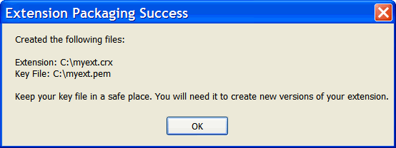
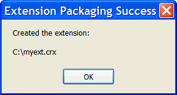

# 完成并发布应用

# 自动升级

## Contents

1.  Overview
2.  Update URL
3.  Update manifest
4.  Testing
5.  Advanced usage: request parameters
    1.  Future work
6.  Advanced usage: minimum browser version

我们希望扩展能自动升级，理由和让 chrome 自动升级一样：修改程序 bug 和安全漏洞 ，增加新功能，提升性能，改善体验。

如果你通过[Chrome Developer Dashboard](https://chrome.google.com/webstore/developer/dashboard),发布你的扩展，可以忽略此页。你可以使用 Dashboard 发布更新过的版本给用户，就像在 Extensions Gallery 和 Chrome Web Store 面一样。.

## 概述

*   一个扩展的 manifest 文件里面必须指定一个"update_url"来执行升级检测。
*   扩展可以托管在 Chrome Web Store，也可以发布到极速浏览器应用开放平台上。
*   如果托管在 Chrome Web Store 则 update_url 应该是：[`clients2.google.com/service/update2/crx`](http://clients2.google.com/service/update2/crx)

*   如果托管在极速浏览器应用开放平台上则 update_url 应该是：[`upext.chrome.360.cn/intf.php?method=ExtUpdate.query`](http://upext.chrome.360.cn/intf.php?method=ExtUpdate.query)

为了能够快速和稳定的更新升级，我们建议将扩展托管在 360 服务器。

**注：如果不指定 update_url，在使用 360 同步服务的情况下安装扩展，重启浏览器后导致扩展丢失。**

## Update URL 升级 url

如果将扩展托管在 360 服务器上，那么你需要在 manifest.json 文件里面加一个 update_url 字段，如下：

```js
{
    "name": "My extension",
    ...
 **"update_url": "http://upext.chrome.360.cn/intf.php?method=ExtUpdate.query"**,
    ...
} 
```

## 升级 manifest

服务器返回的升级 manifest xml 格式文件看起来如下：

```js
<?xml version='1.0' encoding='UTF-8'?>
<gupdate xmlns='http://www.google.com/update2/response' protocol='2.0'>
  <app appid='**aaaaaaaaaaaaaaaaaaaaaaaaaaaaaaaa**'>
    <updatecheck codebase='**http://myhost.com/mytestextension/mte_v2.crx**' version='**2.0**' />
  </app>
</gupdate> 
```

(这个 xml 格式是从 google 升级系统 Omaha 那边借用过来的，具体见[`code.google.com/p/omaha/`](http://code.google.com/p/omaha/)）

**appid** 属性 appid 是一这个扩展的 id，基于扩展的公钥 hash 计算而来，在 Packaging。里面介绍过，你可以找到你的扩展的 id，通过**Chrome://extensions**.ackaing 里面介绍过。

**codebase** 属性 codebase 是 crx 文件的 url。

**version** 这个属性被客户端用来判断是否真的要从 codebase 下载 crx 文件。这个值必须和 crx 文件的 manifest.json 里面的版本参数吻合。

一个升级 manifest xml 文件可以包含多个扩展的信息，通过多个 app 标记。

## 测试

缺省的升级检测频率是每小时一次。你可以通过扩展页面的现在立刻升级扩展来强制升级。

另外一种选择是通过命令行参数--extensions-update-frequency 来设置更加频繁的升级间隔，单位秒。例如，每 45 秒检测一次，你可以用这样的命令行参数来运行 chrome：

```js
chrome.exe **--extensions-update-frequency=45** 
```

注意这个将影响所有的已经安装的扩展，因此请斟酌这样做带来的带宽和服务器负载的影响。你可能想临时卸载你所有的扩展除了正在调试的，在正常浏览器使用中不应该用这个选项来运行。

## 高级使用：请求参数

最基本的升级机制在服务端被设计的极其简单，就是往 web 服务器-如 apache 上放就是一个静态 xml 文件，然后升级这个 xml 文件如果你的扩展有新版本了。

高级开发者可能希望充分利用升级机制，通过往升级 manifest url 请求参数里面添加参数来识别扩展的 id 和版本，他们能使用运行在一个动态页面来代替静态 xml 以使用同一个 url 来控制所有的扩展的升级。

请求参数格式：

?x=<extension_data>

其中 extension_data 是一个编码过的 url 字符串，其格式：

id=<id>&v=</id>

对于这个例子，说明我们有两个已经安装的扩展

Extension 1 with id "aaaaaaaaaaaaaaaaaaaaaaaaaaaaaaaa" and version "1.1" Extension 2 with id "bbbbbbbbbbbbbbbbbbbbbbbbbbbbbbbb" and version "0.4"

两个拓展都使用同一个 update_url:[`test.com/extension_updates.php`](http://test.com/extension_updates.php)

两个请求看起来像这样：

[`test.com/extension_updates.php?x=id%3Daaaaaaaaaaaaaaaaaaaaaaaaaaaaaaaa%26v%3D1.1`](http://test.com/extension_updates.php?x=id%3Daaaaaaaaaaaaaaaaaaaaaaaaaaaaaaaa%26v%3D1.1) [`test.com/extension_updates.php?x=id%3Dbbbbbbbbbbbbbbbbbbbbbbbbbbbbbbbb%26v%3D0.4`](http://test.com/extension_updates.php?x=id%3Dbbbbbbbbbbbbbbbbbbbbbbbbbbbbbbbb%26v%3D0.4)

在 3.0.196.x 之前的版本中有一个 bug，地方在合并多个参数上。 ([`crbug.com/17469`](http://crbug.com/17469)).

### 将来的工作

虽然没有实现，我们还是在一个独立的请求列出多个扩展。对于上面的例子，这个请求看起来像这样：

[`test.com/extension_updates.php?x=id%3Daaaaaaaaaaaaaaaaaaaaaaaaaaaaaaaa%26v%3D1.1&x=id%3Dbbbbbbbbbbbbbbbbbbbbbbbbbbbbbbbb%26v%3D0.4`](http://test.com/extension_updates.php?x=id%3Daaaaaaaaaaaaaaaaaaaaaaaaaaaaaaaa%26v%3D1.1&x=id%3Dbbbbbbbbbbbbbbbbbbbbbbbbbbbbbbbb%26v%3D0.4)

如果使用同一个 update_url 的扩展太多，导致请求的 URL 太长（超过 1024 字符），升级检测将发起 POST 请求，同时把请求参数打包在 POST 里面。

## 高级使用:最小浏览器版本

随着我们添加越来越多的 api 到扩展系统，你可能希望发布一个升级过的扩展，仅仅只允许运行在新版本的浏览器上。虽然 chrome 是自动升级的，但所有用户升级到新版浏览器也需要很多天时间。为了确保一个指定的扩展升级只作用在特定的比较高的版本上，你可以添加**prodversionmin**到你的升级 manifest 文件里面的 app 标签。例如：

```js
<?xml version='1.0' encoding='UTF-8'?>
<gupdate xmlns='http://www.google.com/update2/response' protocol='2.0'>
  <app appid='aaaaaaaaaaaaaaaaaaaaaaaaaaaaaaaa'>
    <updatecheck codebase='http://myhost.com/mytestextension/mte_v2.crx' version='2.0' **prodversionmin='3.0.193.0'**/>
  </app>
</gupdate> 
```

这个配置确保只有运行在 3.0.193.0 以上的用户才升级到 2.0 版本的扩展。

# 托管

本页告诉你如何在自己的服务器上托管 .crx 文件。如果你仅仅通过[Chrome Web Store](http://chrome.google.com/webstore)发布扩展，应用，或者主题那么你不需要本页。取而代之的是查阅 Chrome Web Store 帮助和[开发者文档](http://code.google.com/chrome/webstore/index.html)。

**注意:**如果你已经把扩展发布到[扩展库](https://chrome.google.com/extensions),扩展就会合并到 Chrome Web Store 里。

按照惯例, 无论是 Chrome Web Store 还是特定服务器所提供的扩展, 可安装的 web apps, 以及主题都是.crx 文件。 当你使用[Chrome 开发者面板](https://chrome.google.com/webstore/developer/dashboard)上传 ZIP 文件的时候，面板会创建.crx 文件。

如果你不是使用面板来发布，那么你需要像打包中所描述的那样自己创建.crx 文件。你也可以指定自动更新信息，确保你的用户可以得到最新的.crx 文件副本。

一个服务器托管.crx 文件必须使用适当的 HTTP 头,这样用户能够通过点击一个连接进行安装。

如果下列**任何**一种情况成立，Google Chrome 认为一个文件是可安装的：

*   文件有 application/x-chrome-extension 内容类型
*   文件后缀是.crx 并且下列两个条件都成立：
    *   文件未被送达的 HTTP 头 X-Content-Type-Options: nosniff
    *   文件被送达的内容类型是下列之一:
        *   empty string
        *   "text/plain"
        *   "application/octet-stream"
        *   "unknown/unknown"
        *   "application/unknown"
        *   "*/*"

最常见的识别一个可安装的文件失败的原因就是服务器发送了 X-Content-Type-Options: no sniff 头。第二个最常见的原因是服务器发送了一个不在上面列表中的未知内容类型 。解决 HTTP 头的问题，要么修改服务器配置或者尝试在另外的服务器上托管.crx 文件。

# 打包

本章描述如何给你的扩展打包。正如 综述 中提到的扩展文件是一个签名的 ZIP 文件，扩展名是 crx。比如 myextension.crx.

**注意:** 如果你使用 [Chrome Developer Dashboard](https://chrome.google.com/webstore/developer/dashboard),发布你的扩展，你将无需自己打包。你自己打包一个 crx 的唯一原因是你需要发布一个非公开版本，比如一个 alpha 测试版本给测试用户。

当你打包一个扩展到时候。这个扩展获得唯一的一对密钥，其中的公共密钥用于标识这个扩展，私密密钥用于保存私密信息和给这个扩展的各个版本签名。

## 创建一个包

为扩展打包的步骤:

1.  访问如下 URL 进入扩展管理页面:

    > **chrome://myextensions/extensions**

2.  如果开发人员模式边上有 + , 点击 + 以展开开发人员模式。

3.  点击"打包扩展程序"按钮，会出现一个对话框。
4.  在扩展程序根目录中填入你扩展所在的目录，如： c:myext. (你可以忽略其他项，第一次打包时你无需指定私钥。)
5.  点击确定按钮。会生成两个文件： a .crx , 是一个真正的扩展文件，可以被安装。另一个 a .pem 文件, 是你的私钥文件。

**请妥善保存你的私钥文件，尽可能放在安全的地方。在做以下事情的时候，你将需要用到它：**

*   更新 这个扩展
*   使用 [Chrome Developer Dashboard](https://chrome.google.com/webstore/developer/dashboard) 上传这个扩展

如果扩展打包成功，你将看到如下的对话框，告诉你在哪里可以找到 crx 文件和 pem 文件:



## 更新一个包

为你的扩展创建一个更新版本的步骤如下:

1.  增加 manifest.json 文件中的版本号字段。
2.  访问如下 URL 进入扩展管理页面: **chrome://myextensions/extensions**
3.  点击"打包扩展程序"按钮，会出现一个对话框。
4.  在扩展程序根目录中填入你扩展所在的目录，如： c:myext.
5.  在私有密钥文件中填入你私有密钥所在的位置，如： c:myext.pem.
6.  点击确定按钮。

如果你更新扩展成功，你会看到如下对话框：



## 用命令行打包

另一种打包方式是用特定的命令行参数，--pack-extension 指定扩展所在的文件夹，--pack-extension-key 指定私钥所在的文件位置，然后调用 chrome.exe 下面是示例：

```js
chrome.exe --pack-extension=c:myext --pack-extension-key=c:myext.pem 
```

如果你不想看到对话框，请使用 --no-message-box。

## 包格式和脚本

获取更多创建 crx 文件的包格式的信息和脚本的要点，请参见：[CRX 包格式。](http://code.google.com/chrome/extensions/crx.html)