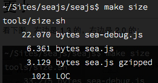

# 2.0.0

由于涉及重要的非兼容性修改以及插件的独立化，直接从 1.3 升级到 2.0

这个版本将集中在：

*   **做减法**：根据实际使用情况，将过度设计或不合理的功能去掉。
*   **可扩展**：插件机制的完善，以及插件的丰富。

## 下载使用

赶快下载试用吧：[下载](http://seajs.org/docs/#downloads)
记得阅读一遍文档。

Node.js 环境下，可以通过命令行下载：

```js
$ npm install spm -g
$ spm install seajs 
```

## 核心特点

### 更小

大小减少近一半，目前 gzip 后不到 3.2K



### 更快

Sea.js 2.0 在性能上进行了非常细致地调优，下图是 [jsPerf](http://jsperf.com/seajs-vs-requirejs) 的性能测试结果：


另一个测试用例：

*   [`seajs.org/tests/speed/thousand-modules/test-requirejs.html`](http://seajs.org/tests/speed/thousand-modules/test-requirejs.html)
*   [`seajs.org/tests/speed/thousand-modules/test-seajs.html`](http://seajs.org/tests/speed/thousand-modules/test-seajs.html)

依赖越复杂，加载的模块越多，Sea.js 的性能优势越明显。

### 更好

与 1.3 相比，2.0 在以下几点做了很大优化：

1.  **API 精简**。2.0 的 API 非常简约，常用的只有 7 个： [API 快速参考](https://github.com/seajs/seajs/issues/266)

2.  **配置更友好**。让 alias、map 的含义更明确，同时增加了 vars、paths、plugins、data-config 等配置，详见：[配置](https://github.com/seajs/seajs/issues/262)、[模块的加载启动](https://github.com/seajs/seajs/issues/260)

3.  **define 方法的参数逻辑更简单**。从之前比较灵活，简化为只支持 `define(fn)` 和 `define(id, deps, fn?)` 两种格式。文档：[#242](https://github.com/seajs/seajs/issues/242)

4.  **插件优化**。从 2.0 开始，Sea.js 内置了小巧的事件机制，所有插件都基于事件来实现，更简单易懂。详情：[常用插件](https://github.com/seajs/seajs/issues/265)、[插件开发指南](https://github.com/seajs/seajs/issues/264)

5.  **对开发调试更友好**。`sea.js` 已支持 SourceMap，发生错误时，可以快速定位到源码处。另外，增加了 nocache 插件，优化了 debug 插件，并将 `seajs.log` 和 `seajs.find` 移到 debug 插件中，详见：[Sea.js 的调试接口](https://github.com/seajs/seajs/issues/263)、[调试插件](https://github.com/seajs/seajs/issues/270)

6.  **对 Node.js 的支持更完美**。目前 Sea.js 在 Node.js 的版本也是基于事件扩展，这样能保证与浏览器版本的功能一致性。详见源码，以及 [与 Node.js 兼容](https://github.com/seajs/seajs/issues/275)

7.  **文档大量优化**。[seajs.org](http://seajs.org/) 已经全部梳理过一遍，每一篇文档都花了很大心思，推荐无论是新用户还是老用户，都仔细阅读一遍。

8.  **测试用例优化**。目前测试用例已达 470 多个，涵盖了绝大部分使用场景。这可以保证 Sea.js 的大胆前行。测试用例在线地址：[tests/runner.html](http://seajs.org/tests/)

9.  **对循环依赖的支持更好**。解决了 1.3 中循环依赖检测时的性能问题，同时提示信息更精准。

10.  **可以直接使用 jQuery 等非 CMD 模块**。通过 shim 插件，可以直接使用普通 JavaScript 文件了，详见：[shim 插件](https://github.com/seajs/seajs/issues/579)

## 构建工具

spm 已重生，今天同步发布 2.0 版本： [spmjs/spm2#12](https://github.com/spmjs/spm2/issues/12)

关注构建、包管理的，一定要去看看哦。

## 致谢

感谢 Sea.js 的每一个用户，正是你的关注、使用和建议，让 Sea.js 越来越好。

特别感谢在有奖征文活动和代码优化活动中，各位的参与。

### 捐赠信息公布

Sea.js 社区从 1.3.1 开始，接受大家的捐助：


Sea.js 目前的核心开发人员来自支付宝、腾讯、阿里巴巴等公司，这是一个无公司界限的开源产品，开放而自由！

## 详细更新记录

### 讨论纪要

*   [#448](https://github.com/seajs/seajs/issues/448) 借鉴 OzJS
*   [#452](https://github.com/seajs/seajs/issues/452) use 参数为空时，是否应该执行 callback（结论：保持现状，执行 callback）
*   [#453](https://github.com/seajs/seajs/issues/453) Sea.js 的错误处理机制（结论：保持现状）
*   [#460](https://github.com/seajs/seajs/issues/460) 严格的版本和依赖控制带来的喜与忧（无解，根据具体场景选择最佳实践）
*   [#462](https://github.com/seajs/seajs/issues/462) Sea.js 的重新设计与实现（分歧点已分解到其他 issues 中推进）
*   [#470](https://github.com/seajs/seajs/issues/470) 优化 IE 下模块 id 的获取方式（结论：尝试失败，详见 issue 中的总结）

### 非兼容式修改

*   [#438](https://github.com/seajs/seajs/issues/438) 去掉 firstModuleInPackage 支持
*   [#440](https://github.com/seajs/seajs/issues/440) 去掉 alias 中的版本简写支持
*   [#441](https://github.com/seajs/seajs/issues/441) 自带插件调整
*   [#458](https://github.com/seajs/seajs/issues/458) modules.seajs.org 调整
*   [#476](https://github.com/seajs/seajs/issues/476) 去除 plugin-i18n 插件
*   [#490](https://github.com/seajs/seajs/issues/490) id 解析增加模板变量功能
*   [#492](https://github.com/seajs/seajs/issues/492) seajs.modify 的必要性以及事件机制
*   [#493](https://github.com/seajs/seajs/issues/493) Module.STATUS 精简
*   [#499](https://github.com/seajs/seajs/issues/499) 将 seajs.importStyle 转移到构建工具中
*   [#502](https://github.com/seajs/seajs/issues/502) 去掉 Module._getCompilingModule 方法
*   [#510](https://github.com/seajs/seajs/issues/510) id2uri 解析规则调整
*   [#516](https://github.com/seajs/seajs/issues/516) [#534](https://github.com/seajs/seajs/issues/534) 优化 seajs 自身的异步加载支持

### 新特性 & 优化增强

*   [#442](https://github.com/seajs/seajs/issues/442) 去掉源码中对 combo 规则的硬编码
*   [#443](https://github.com/seajs/seajs/issues/443) map 配置可指定是否影响 module.uri
*   [#459](https://github.com/seajs/seajs/issues/459) flush 插件 [#505](https://github.com/seajs/seajs/issues/505)
*   [#465](https://github.com/seajs/seajs/issues/465) 优化循环依赖检测逻辑
*   [#479](https://github.com/seajs/seajs/issues/479) IE 下，当 id 存在时，不需要再去自动获取脚本路径
*   [#481](https://github.com/seajs/seajs/issues/481) debug 模式开启后对 Chrome 断点调试有影响
*   [#503](https://github.com/seajs/seajs/issues/503) seajs.log 避免循环依赖
*   [#509](https://github.com/seajs/seajs/issues/509) 优化测试用例
*   [#517](https://github.com/seajs/seajs/issues/517) 代码的运行性能调优
*   [#519](https://github.com/seajs/seajs/issues/519) sea.js 支持 source map
*   [#522](https://github.com/seajs/seajs/issues/522) 支持在 Tampermonkey / Geasemonkey 中使用
*   [#526](https://github.com/seajs/seajs/issues/526) 循环依赖信息的 bug
*   [#530](https://github.com/seajs/seajs/issues/530) 增加 data-config
*   [#535](https://github.com/seajs/seajs/issues/535) shim 插件
*   [#537](https://github.com/seajs/seajs/issues/537) Sea.js 的构建使用 Grunt 来替代 Ant
*   [#592](https://github.com/seajs/seajs/issues/592) 全局 error 事件
*   [#595](https://github.com/seajs/seajs/issues/595) style 插件

### Bug Fix

*   [#456](https://github.com/seajs/seajs/issues/456) [#478](https://github.com/seajs/seajs/issues/478) 解析依赖时，移除代码注释产生的问题

### 文档

*   [#501](https://github.com/seajs/seajs/issues/501) Sea.js 2.0 定位与功能概览
*   [#529](https://github.com/seajs/seajs/issues/529) 发布 Sea.js 2.0.0 beta2
*   [#538](https://github.com/seajs/seajs/issues/538) 构建工具
*   [#545](https://github.com/seajs/seajs/issues/545) 如何向开源社区提问题
*   [#278](https://github.com/seajs/seajs/issues/278) 社区文档整理
*   [#547](https://github.com/seajs/seajs/issues/547) 前端模块化开发的价值
*   [#586](https://github.com/seajs/seajs/issues/586) 发布 Sea.js 2.0.0 beta3
*   [#588](https://github.com/seajs/seajs/issues/588) 前端模块化开发那点历史
*   [#591](https://github.com/seajs/seajs/issues/591) 发布 Sea.js 2.0.0b4